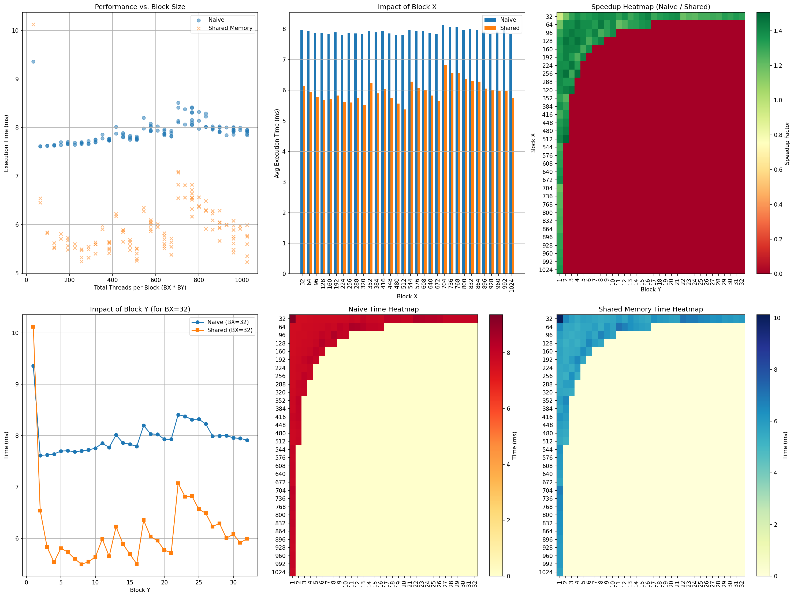

# CUDA 并行策略 实验报告

刘家豪 2024010779

## 测量结果

由于测量结果数据较多, 将其可视化呈现如下. 测量结果上传到 [网盘链接](https://cloud.tsinghua.edu.cn/f/aac85416b9db46649cca/).

从上述可视化图表和原始数据中可以观察到以下规律: 

**1. 不同的 thread block size 对程序性能的影响**
*   对于 Naive 模式: 程序的执行时间对 Thread Block Size 的变化相对不敏感. 如图中“Performance vs. Block Size”所示, 无论块大小如何变化, Naive 模式的执行耗时基本稳定在 7.6 ms ~ 8.5 ms 的区间内波动. 只有在一些极端配置（如 Block X=32, Block Y=1）时耗时会略有增加至 9.35 ms. 
*   对于 Shared Memory 模式: 执行时间对 Thread Block Size 敏感. 不仅在散点图上呈现较大的纵向离散度, 其性能极差差值也非常大: 最优配置 `(512, 2)` 耗时仅 5.22 ms, 而最差配置 `(32, 1)` 耗时高达 10.12 ms. 

**2. Shared memory 是否使用, 对程序性能的影响**
*   总体呈正向优化, 并非绝对优化. 从图中 “Impact of Block X” 的对比条形图可以看出, 在绝大多数配置下, Shared Memory 模式的平均执行时间均明显低于 Naive 模式, 能够带来平均约 1.34 倍的加速. 在特定的极端配置下, 使用 Shared Memory 的性能反而不如 Naive 版本. 

**3. 上述两者的相互影响**
*   如左下角的折线图 “Impact of Block Y (for BX=32)” 所示. 当 `Block Y = 1` 时, Shared Memory 的执行时间大幅增加（约 10.12 ms）, 慢于同配置的 Naive 模式（约 9.35 ms）. 但只要 `Block Y >= 2`, Shared Memory 耗时明显下降, 并在此后的各个范围里持续保持对 Naive 模式的明显优势. 
*   当 `Block Y = 1` 时负优化; 当 `Block Y >= 2` 且 `Block X` 较大时, 迅速成为正优化, 且随着 `Block X` 和 `Block Y` 的合理增加, 性能收益趋向最佳表现区间. 

## 原因分析

- 对于这个程序:
  - 最佳配置: `Block X = 512`, `Block Y = 2`, 执行时间约为 5.22 ms. Block X 为 32 的倍数确保了Warp 内的线程在访问 `dev_input` 时能映射到连续的内存地址, 最大限度利用内存带宽; 总线程数 `BX * BY` 在 128-512 之间能维持较高的活跃度, 掩盖内存访问延迟.
  - Shared memory 不总是带来优化, 当 `BY=1` 时，垂直方向没有重叠复用, 数据被搬进 Shared Memory 后仅被读取一次, 这不仅增加了显存读写操作, 还引入了 `__syncthreads()` 同步开销和复杂的边界判断.
  - BlockY 较大时 Shared Memory 有效果, 随着 `BY` 增加, Shared Memory 中缓存的“行”被复用的比例增大.
  - 目前 `shared_mem` 内有大量的 `if (x_last)` 和 `if (y_last)` 逻辑, 可以采用 Padding 的方式消除这些分支判断.
- 对于任意一个给定程序:
  - `BlockX` 必须是 32 的倍数; 通常将总线程数设为 128 或 256, 过小无法掩盖延迟，过大可能导致单个 Block 占用过多寄存器.
  - 如果同一份数据在计算过程中会被 Block 内不同的线程多次读取, 则必须使用 Shared Memory; 如果原始访存是不连续的, 可以使用 Shared Memory 作为中转站.