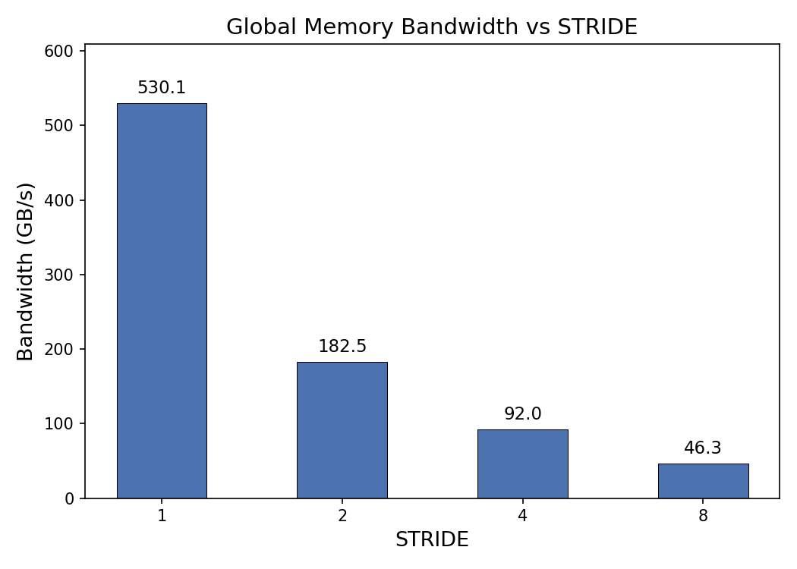
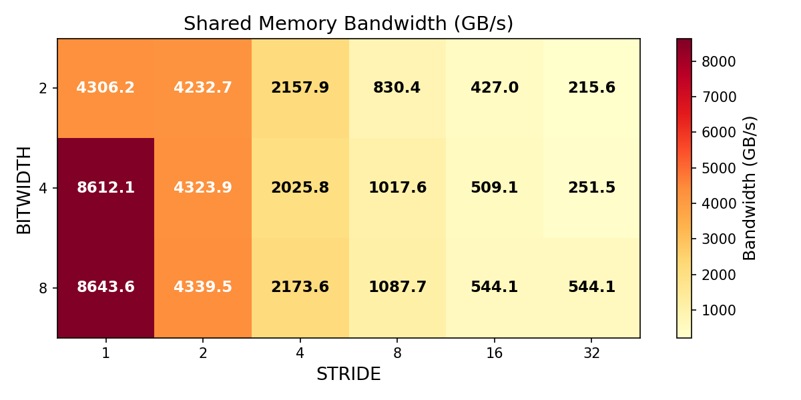

# CUDA 优化实验报告

2024010779 刘家豪

## 测量结果

### `test_gmem.cu` 的 `STRIDE`

| STRIDE | Bandwidth (GB/s) |
|:------:|:----------------:|
| 1      | 530.113          |
| 2      | 182.494          |
| 4      | 92.001           |
| 8      | 46.287           |

### `test_smem.cu` 的 `BITWIDTH` 和 `STRIDE`

| BITWIDTH \ STRIDE | 1      | 2      | 4      | 8      | 16     | 32     |
|:-----------------:|:------:|:------:|:------:|:------:|:------:|:------:|
| 2                 | 4306.2 | 4232.7 | 2157.9 | 830.4  | 427.0  | 215.6  |
| 4                 | 8612.1 | 4323.9 | 2025.8 | 1017.6 | 509.1  | 251.5  |
| 8                 | 8643.6 | 4339.5 | 2173.6 | 1087.7 | 544.1  | 544.1  |

## 性能变化来源

 性能变化的主要来源是 GPU 的内存合并访问.
- `STRIDE = 1` 时线程访问连续地址, 可合并为最少的事务数, 带宽最高; `STRIDE >= 2` 时线程访问离散地址, 需要发起更多独立事务, 带宽随 `STRIDE` 增大而下降.
- 当 STRIDE 较小时, 缓存命中率较高; STRIDE 增大导致空间局部性降低, 缓存未命中增加, 进一步降低有效带宽.

### `test_smem.cu`

- 固定 BITWIDTH 时程序性能变化来源于 **Bank Conflict**. 共享内存分为 32 个 bank, 当多个线程同时访问同一 bank 的不同地址时发生 bank conflict, 访问被串行化, 带宽下降. 
- `BITWIDTH = 2` 为 16-bit 元素, 一个 bank 可存放两个元素, `STRIDE = 1, 2` 时相邻线程访问同一 bank 的不同 16-bit 部分, 硬件通过 broadcast 并行处理, 无 conflict.
- `BITWIDTH = 4` 为 32-bit 元素, 每个元素占 1 个 bank, `STRIDE = 1` 时无 conflict, 带宽最高; `STRIDE` 每倍增, conflict 程度倍增, 带宽相应减半.
- `BITWIDTH = 8` 为 64-bit 元素, 跨 2 个 banks, `STRIDE = 1` 时即产生 2-way conflict; `STRIDE = 16, 32` 时所有线程访问同一 bank 对, 达到 32-way conflict, 带宽不再变化.
